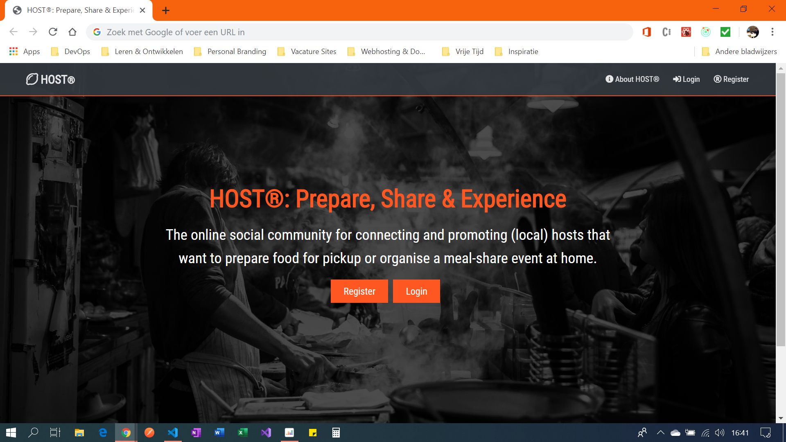
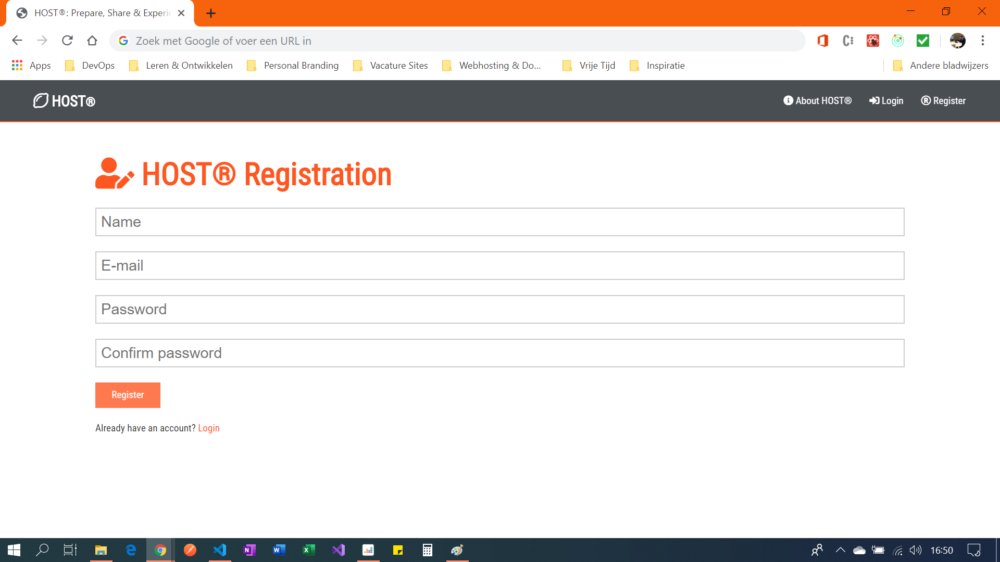
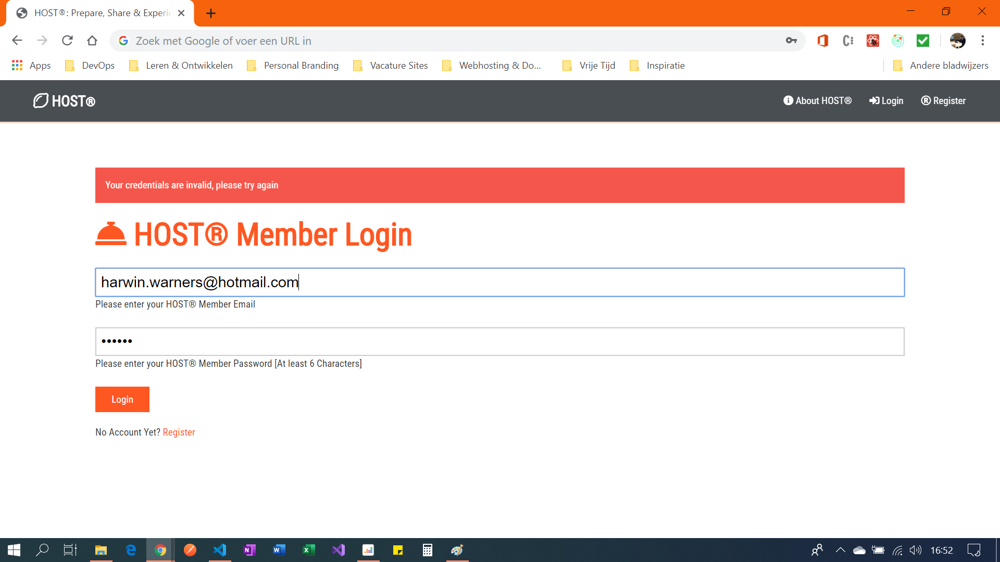
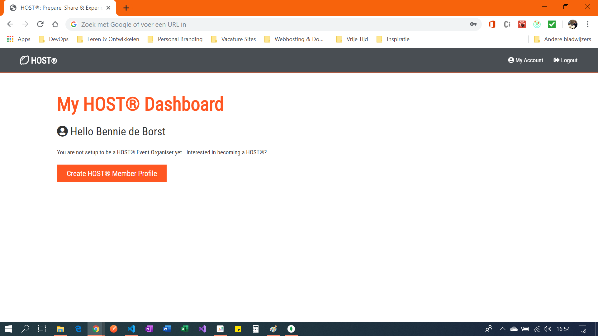
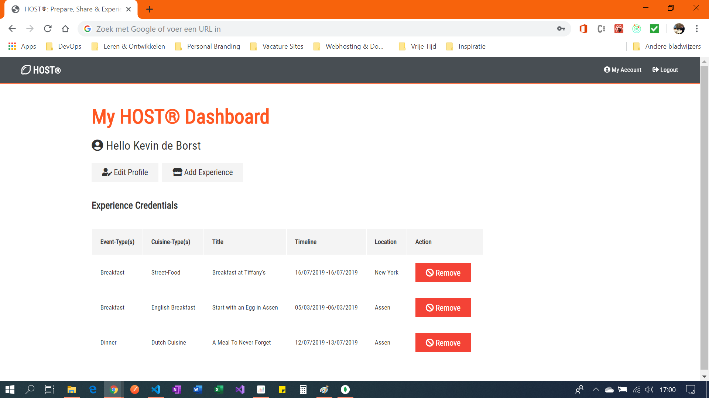
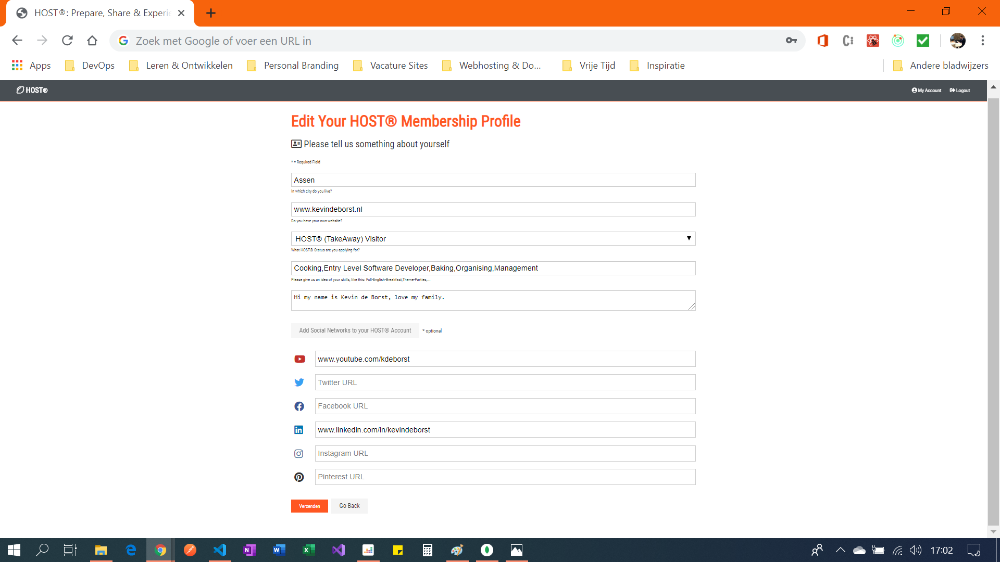
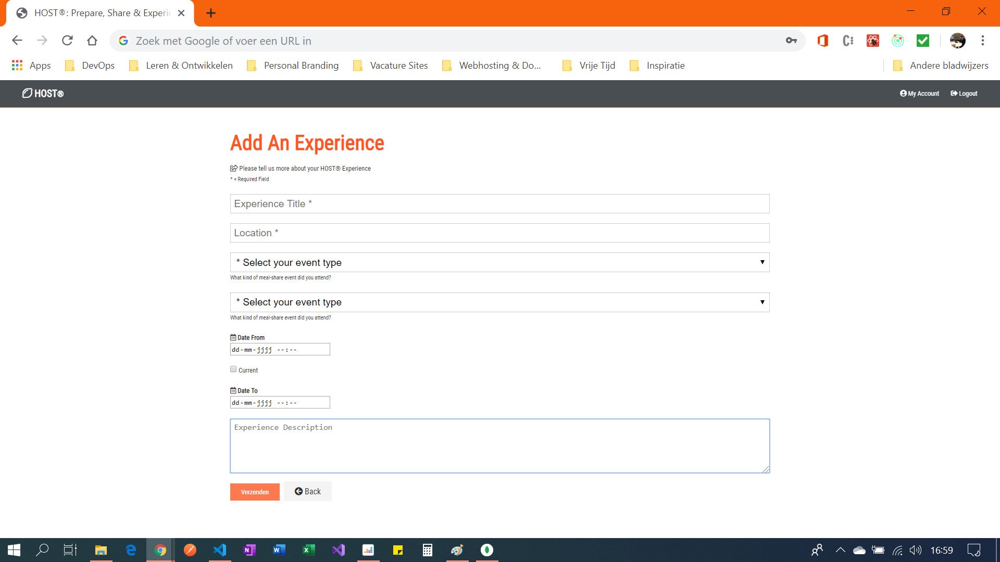

# HOST® MEAL SHARE SOCIAL COMMUNITY #
### Design Document: Final Microsoft Professional Capstone Project ###
___MICROSOFT CERTIFIED SOFTWARE DEVELOPER (MCSD)___
___ENTRY LEVEL SOFTWARE DEVELOPMENT___

|  Author: Kevin de Borst  |  Institute: ITPH Academy Zwolle  |  Publication: 25 Juli 2019  |  v2.0.0  |

- - - -

### TITLE: HOST® MEAL SHARE SOCIAL COMMUNITY ###

    
EXECUTIVE SUMMARY

    <h4>Problem Area</h4>
    
Social exclusion(s), loneliness, community sharing, food-waste.

    <h4>Inspiration</h4>
    
http://www.eatwith.com; http://www.cookapp.com; http://experiences.chefsfeed.com

    <h4>Desired App</h4>
    
Web-based social community platform for promoting meal-sharing initiatives (experiences) at local homes.

    
PROJECT MAIN OBJECTIVES

    <ol>
        <li>At least 2 different UI pages and at least 3 different user input elements.</li>
        <li>At least 1 UI element is affected by the user’s input.</li>
        <li>After the user submits their input a decision is made on that input that can cause at least 2 different results.</li>
        <li>A user’s information is collected together in a single code structure.</li>
        <li>Support for UNICODE characters in all user text input.</li>
        <li>Date and time formats reflect the user’s local settings.</li>
        <li>At least one string is localisable.</li>
    </ol>

    
TECHNOLOGIES: FULL-STACK MERN WEBAPPLICATION

    

        
Approach

        <ul>
            <li>Code-First Development</li>
            <li>Mobile First Design</li>
            <li>Scalable Templates</li>
            <li>RESTful Web API (CRUD)</li>
            <li>Open Source Rich Client Development</li>
        </ul>
    

    

        
Core Script(s) & Extentions

        <ul>
            <li>JavaScript ECMAScript 6+ (ES6)</li>
            <li>JavaScript React Syntax (JSX)</li>
        </ul>
    

    

        
IDEs/ SDKs

        <ul>
            <li>Visual Studio Code 2019 v1.36.1</li>
            <li>MongoDB Compass Community Edition 1.18.0</li>
            <li>Postman DE 7.1.1</li>
        </ul>
    

    

        
Frameworks

        <ul>
            <li>React v.16.8.6</li>
            <li>Redux v.4.0.4</li>
        </ul>
        

    

        
Technologies/Libraries

        <ul>
            <li>HTML 5.0 & CSS 3.0</li>
            <li>Bootstrap v.4.3.1 & Font Awesome v.5.9.0</li>
            <li>React Hooks & Async/ Await</li>
            <li>JSON Web Tokens v8.5.1</li>
            <li>Bcrypt JS Password Hashing v.2.4.3</li>
        </ul>
    

    

        
Plugins & Extension

        <ul>
            <li>Axios v0.19.0</li>
            <li>Uuid v.4.0</li>
            <li>Moment.JS v.2.24.0</li>
            <li>Redux Thunk v.2.3.0</li>
            <li>Redux DevTools v.2.13.8</li>
            <li>React-Moment v.0.9.2</li>
            <li>React-Redux v.7.1.0</li>
            <li>React Developer Tools v.2.13.8</li>
        </ul>
    

    

        
Server(s)

        <ul>
            <li>Express JS v.4.17.1</li>
            <li>Express Validator (Plugin)</li>
            <li>Mongoose v.5.6.6 (Plugin)</li>
        </ul>
    

    

        
Database

        <ul>
            <li>Mongo DB Atlas 4.0</li>
        </ul>
    

### TABLE OF CONTENT ###

#### INTRODUCTION ####
1. [What should it be](#what-should-it-be "Goto what-should-it-be")
2. [Where will it work](#where-will-it-work "Goto where-will-it-work")
3. [Who will use it](#who-will-use-it "Goto who-will-use-it")
4. [How will it be used](#how-will-it-be-used "Goto how-will-it-be-used")
5. [How do you market it?](#how-do-you-market-it "Goto how-do-you-market-it")
6. [What could go wrong?](#what-could-go-wrong "Goto what-could-go-wrong")

#### RESEARCH METHODOLOGY: INTERVIEW ####
7. [Segmentation dimensions](#segmentation-dimensions "Goto segmentation-dimensions?")
8. [Demographic situation](#demographic-situation "Goto demographic-situation")
9. [Pshychographic situation](#psychographic-situation "Goto psychographic-situation")

#### PERSONA'S & SCENARIO'S ####
10. [Persona 1: Cookie Monster](#persona-1-cookie-monster "Goto persona-1-cookie-monster")
11. [Persona 2: Elder Claire Thompson](#persona-2-elder-claire-thompson "Goto persona-2-elder-claire-thompson")

#### LIST OF APP FEATURES ####
12. [Core App Features](#core-app-features "Goto core-app-features")
13. [MS MCSD's Main Project Requirements](#ms-mcsds-main-project-requirements "Goto ms-mcsds-main-project-requirements")
14. [Desired Outcome: Prototype Core Features](#Desired-Outcome-Prototype-Core-Features "Goto Desired-Outcome-Prototype-Core-Features")
15. [Bugtesting](#Bugtesting "Goto BUGTESTING")
16. [Optional App Features](#optional-app-features "Goto optional-app-features")

#### HOST® WIREFRAMES ####
17. [Wireframes](#wireframes "Goto Wireframes")

#### TECHNOLOGIES ####
18. [Preferred Technologies: Full Stack MERN](#preferred-technologies-full-stack-MERN "Goto preferred-technologies-full-stack-MERN")

- - - -

### What should it be? ###
An online social web platform for securely: finding, promoting, sharing experiences and commenting on the nearest (local) hosts who want to prepare food for pickup or organise a meal-share event/experience at home (non-commercial food preparation).

### Where will it work?	###
The RESTful Web API and its front-end components allow users to: (1) find, (2) view, (3) comment, (4) like and (5) become friends with registered: (1) HOST® Experience Events, (2) HOST® Organiser Profiles; or, (3) (non-commercial) HOST® Takeaway Experience. HOST® is to be introduced Nationally (The Netherlands) and a mobile (design) and code first approach is preferred. This application is requested to be written in English and will be upgraded with Dutch language support before testing and deployment. However, this feature falls out of the scope of this project and should be disregarded for now.

### Who will use it? ###
Before we continue, please be aware that users are required to register with HOST®. Only then, access to private details on: profiles, event experiences, (Geo)location details, etc. is given. Therefore, HOST® decided to segment the market into the following Three distinct (registered) typologies: 

1. HOST® Regular Guest
Application users who decide not to register will have access to publicly published material only (e.g. 'about-us', 'index', etc.). Those users who do register with HOST®, are assigned a: 'HOST® Regular Guest'-role, by default. Registered HOST® guests should at least have accesss to: (1) the approximate location, (2) profiles; and, (3) create/read messages of HOST® Experience Organisers. A HOST® Regular Guest can be any user on the market and they do not require a personal profile. To be a bit more specific: this group often holds an interest in: (1) meal-sharing, (2) cooking/baking or (3) home-food preparation - non-commercially. 

2. HOST® Takeaway Guest
A common trait of HOST® Takeaway Guests is that they value friendship and experience based on: loyalty, logical reasoning and long-term relationships. Often, they seem to acknowledge: (1) intellectuality, (2) time and (3) money over excitement or other emotions (Meyer-Briggs, 2019). Due to these traits, a HOST® takeaway guest is more likely to order a meal and pick it up at the agreed location; instead of visiting an event at a HOST® Organiser. This type of guest requires a personal HOST® Member-profile, order -and order-history features.

3. HOST® Experience Organiser
One could argue that a HOST® organisers and visitors often value friendships based on: (1) emotional connection, (2) similarities, (3) environment, (4) degree of excitement and (5) emotions over intellectuality (Meyer-Briggs, 2019). This group is perceived as a ‘community-aware helper group’ who likes to contribute to the society for a small refund instead of commercially making a profit. HOST® Organisers either prepare a meal for pick-up or share a meal with a HOST® Visitor within their own selected environment. Note that an organiser can be a visitor; and, a visitor can be an organiser dependent on who is ‘eating-out’ and who is organising the event. Since the HOST® Experience Organiser is vallued to be the most important core-user/asset for the success of this application; they should be able to: (1) create a profile and receive a personalised dashboard, (2) add event experiences, (3) create order-menu's and/or receive personal orders, (4) create and/or become friends, and so on. Basically, a HOST® Experience should be perceived as an event-organiser who requires the tools to become a professional (non-commercial) community sharer. 

### How will it be used? ###	
In total, there are Three HOST® typologies and one webmaster role. Webmasters should be able to verify and have full CRUD access over e.g.: categories and event registrations - apart from being responsible for the overall functionality of the HOST® website. HOST® organisers, visitors and takeaway guests should be able to either create -or apply to an event as described above.

>Scope of Visitor Functionalities
>>* User visits HOST® website and is prompted to use Geolocation services.
>>* User explores results or searches for a: city, food category or event status.
>>* User can view details of the event or get in contact with the HOST by email.
>>* User & HOST® discuss upon terms, conditions and or pickup location.

>Scope of 'HOST® Experience Organiser' Functionalities
>>* HOST® Regular Guests have to complete a HOST® Takeaway / HOST® Experience Organiser Profile
>>* HOST® Member and offer is promoted on the homepage of HOST®.
>>* Ranking in search results is based on interest (e.g. no. of clicks).
>>* Once the event is finished, it will be automatically be removed.
 
### How do you market it? ###
Social exclusion is often found to be highest amongst elders in social care, community and nursing housings. To reach this target audience, HOST® must reconsider the technology skills of this audience. To overcome this issue, one could argue to target the community homes, nursing houses, etc. directly (offline promotion). Although they are not a direct audience; nurses can help elders by supporting elders in finding a digital HOST® match online. Aside, once could choose for offline match makers for this target audience. To reach the younger audiences, once could argue to promote HOST® via online: SEO, SEA, Social Media; and, offline: home-care, trade and community fairs.

### What could go wrong? ###
Dutch legislation makes a distinction between hobbyist and professionals when it comes to food preparation and hosting events. Once the HOST® Member becomes extremely successful, he/she might earn too much money from meal-sharing and preparation. The Dutch HM Revenue and Customs requires ‘professionals’ to keep a solid administration and tax payments over sold resources. This might become a potential drawback for subscribing (paid) meal-share events on the HOST® website.

Besides, Hygiene and allergy legislation restricts ‘professionals’ to have HACCP and allergy documentation. This could become a future issue, if authorities start to see the HOST® Member as a professional instead of an amateur/hobbyist. The HOST® platform initiative can become obsolete and will not add any value anymore once legislation restricts amateurs from hosting ‘paid’ meal-shares within an online community.

One could argue that HOST® Organisers should be able to fully manage their product offerings themselves. The lack of this feature puts a lot of pressure on the webmaster to verify the incoming HOST® applications on a timely manner.  When the webmaster fails to attend to ‘last-minute’ registrations or when last-minute applications just appears, they cannot be viewed or promoted for a long time on the HOST® website. Nevertheless, the scope of this project is limited and this feature is excluded deliberately for now. When it comes to real-world deployment, I would suggest to include identity verification and personal profiles in order to overcome this limitation.

Meal-sharing is a rather new concept and not a hot phenomenon within the Netherlands (yet). Currently, there are social media platforms that allow users to fully create and manage their own events without intervention of a webmaster. As a result of competitiveness in this area, HOST® could end up with no search results and no meal share initiatives/applications. Besides, one could argue that there are a lot of commercial takeaway services like: ‘ThuisBezorgd’, ‘JustEat’ and ‘Fork’ that guarantee a higher degree in service dimensions.

A Small footnote; the deployment and lifecycle of the app (incl. underlying technologies) must be financed as well. The current design architecture costs a lot of maintenance and money in comparison to i.e. paid account promotions. Since the functionality of the HOST® Community Connector is too little in relation to other social networks and communities at present time, one should choose for technologies and upgrade it with modules that are scalable and easy to expand once this protype is finished. It should be a continuous process until the application is mature enough to compete on the National market and with its community network lookalikes.

 
## INTERVIEW ##

For this research there was chosen to substantiate a personal interview with Silvia Warners-Spijker. To create safe surroundings, the interview was conducted within her personal home-environment. Please refer to the table below for the review.

### SEGMENTATION DIMENSIONS ###
#### Demographic Situation ####
Silvia is 51 years of age and she lives with her husband (42) in Appingedam, a small city in the state: ‘Groningen’ (The Netherlands). They have their own car and they enjoy an income at the minimum welfare level. Silvia is a valuable asset to this research due to her income level, health concerns, personality traits and her small budget to travel, buying groceries and organising parties.

#### Psychographic Situation ####
Silvia has to commute to hospitals and nutritionists at least once a week - due to current health and diet concerns. She is quite dependent on her husband when it comes to doing e.g. grocery shopping and cooking requires her lot of effort, time and energy. Her social environment is restricted to her own family and she has never used food ordering applications before. On the other hand, she uses Google Maps to find her new local nutritionists or hospitals.

For now, Silvia kills her time on social networks, shopping (online and offline) and handcrafting. Nevertheless, this is her second priority. Her first priority is managing and cleaning the household – for as much she can do by herself. If she is being asked the MAGIC questions and everything will be settled at forehand, Silvia would kill her time differently and visit family and friends instead. However; at present, these friends don’t live close and meeting would be a difficult due to money restrictions. “Smartphones help me overcome this barrier as I can (video)call and WhatsApp with my beloved ones from a distance!” She mentions that she does need a little help with configuring her applications to an optimum, as she is not very technical. “This can be very frustrating to me sometimes...”

Silvia is used to go to takeaway restaurants or chooses to eat-out within the restaurant itself. However, this is not something she does quite often and it is something that is perceived as ‘expensive’. Silvia is able to use her smartphone proficiently; however, looking for meal-sharers is something she would have never thought of. She is doubtful if she will ever use it as she has quite a shy personality and doesn’t like changes or different environments a lot. A HOST® Application could improve Silvia’s way of living, give space and ease her daily workload by facilitating (healthy and freshly prepared) food via 3rd party HOST® Members. Nevertheless, she will never host a party or let someone into her home.

Some concerns that where mentioned were Silvia’s allergies, trustworthiness of the potential HOST® Member, potential surprise-elements, taste dislikes, costs and payment facilities. However, she agrees that this initiative also has the potential to work and relates to the experience with her son. He loves to cook and experiment with food, “and he always takes care of my dietary wishes too when he cooks. This is a true experience and very delicious! Besides, it makes me happy to see my son and share such a marvellous experience together. However, I do not think this is something I would experience with someone who is a complete stranger to me. But that’s just my personality”.

## PERSONAS & SCENARIOS ##

> Persona 1: Cookie Monster
>>Cookie Monster is a 20-year old exchange student from the USA who will study in The Netherlands for 12 months due to his academy-minor: ‘Pepernoten Bakken met Bakker Bart’. Cookie Monster is pursuing a traineeship as a pastry chef, but he realises that he has a small community and network to ask for local placement suggestions. Cookie Monster is a very frivolous chap, who can be everybody’s friend and he is currently living in a large refactored farmhouse in Bourtange (a very small village far from the realistic world). Although Cookie is really charismatic and has a lot of great innovative ideas when it comes to pastries, cheesecakes and other delicatessen; he can’t continuously explore the big cities to make himself feel happy. In this case he is both financially and time restricted with regards to his exchange-traineeship. He finds himself feeling lonely and secluded from the Dutch community due to his international background and the small village he lives in. In the meantime, he misses his friends and family in the USA. Cookie thinks: “There is more I can offer!”

#### Current Experiences: ####
Cookie Monster struggles to make new friends and blend into society. He focuses on surviving, rather than experiencing a pleasurable time during his 12 months within The Netherlands. He doesn’t know that Dutch people are crazy about American Chocolate Chip Cookies – which is Cookie’s specialty – and that he could be a very valuable social connector in our Dutch society. For now, he is doubting whether or not he will finish his exchange minor or go back to the USA.

#### Current Solution: ####
Cookie has a laptop and smartphone. One day he decided to try his chances on Tindr and a Dutch Social Network. He fetched his phone, asked Siri for: ‘dating apps and social networks’, and HOST® popped up on the third line within the search results. Cookie became interested and found - based on Geolocation services - that two of his African neighbours are hosting a Puff-Puff Backyard Party. After reading the profile, he wondered what Puff-Puffs are and he confronted his neighbours by commenting on their (online) event - since the neighbours were out at that time. The African neighbours were very enthusiastic and mentioned that the entire village had been invited. Cookie could join for free as he was new and the African neighbours did not know that Cookie had just moved in. Long story short: Cookie made new friends, had a great (international) experience and he added the African Puff-Puff Speciality to his pastry list. Cookie decided to stay and HOST® an American Cookie Party 10 weeks later.

> Persona 2: Elder Claire Thompson
>> Elder Claire Thompson is a very healthy 83-year-old woman who has lost all of her brothers and sisters. Since her friends have all passed away too, she decided to move to a caring institution. 

#### Current Experiences: ####
In the evenings she eats with the other Elders; however, most of them suffer from Alzheimer or other serious mental diseases and the experience is daunting. Due to Elder Claire her healthy lifestyle, she beliefs that she doesn’t fit in with the group and finds herself feeling lonely and misunderstood. She turns to the nurses and asks if they know about a nice place or community where she can be herself and fits in. She would like to make new friends or have a buddy to share her experiences with.

#### Current Solution: ####
The nurses received an offline leaflet from HOST® and decided to look with Elder Claire Thompson for buddies and likeminded people online. Elder Claire found Brian Booze within the search results of HOST® and found that he has a really rich history. He loves mashed potatoes and even drinks Jenever! They are buddies ever since. 

## LIST OF APP FEATURES ##
### CORE APP FEATURES ###
Resources are limited and it is almost impossible to complete all of the above in only Three weeks time. Hence, focus is required and features will be split into: (1) Core; -and, (2) Optional App features (for future development). In some cases, one can find (code-)models and routes which are not implemented within the actual front-end components of the application yet. Please bear with the development of the application and also note that the database user is initialised for Admin. Obviously, this will be changed upon the further development of the application. For now, the main project requirements and the outcome is to be defined as follows:

### MS MCSD's MAIN PROJECT REQUIREMENTS ###
1. At least 2 different UI pages and at least 3 different user input elements.
2. At least 1 UI element is affected by the user’s input.
3. After the user submits their input a decision is made on that input that can cause at least 2 different results.
4. A user’s information is collected together in a single code structure.
5. Support for UNICODE characters in all user text input.
6. Date and time formats reflect the user’s local settings.
7. At least one string is localisable.

#### Desired Outcome: Prototype Core Features ####
* Focus: 
    * security (authorisation)
    * scalability (containers, components)
    * accessibility (cross-platform)
    * ease-of-use (UX, personal interview).
* Public UI Pages: 
    * Landing
    * About HOST®
    * Login
    * Register
* Private UI Pages: 
    * Personalised Dashboard// dashboard changes after creating a profile; otherwise Guest Dashboard (default).
    * Automatic redirect to Dashboard once logged in.
    * Interactive navigation// weblinks change on state ISAUTHENTICATED: true.
* Functionalities:
    * Securely register with personal web-authentication (remember ease of use ['Interview': 'Silvia']).
    * Create/Edit Profile Form from personalised dashboard// No password change functionality (yet)!
    * Add Event and (instantly) display HOST® Organiser Event Experience from personalised dashboard.
* Single Code Structure:
    * Destructured data is to be formatted within the models: User, Profile; and, Message for now.
    * Profile-model will contain (almost all) information (could be used as a binding-model for JSON-data?!)
* UNICODE & Local DateTime Support:
    * Data is to be stored 'in the cloud', preferably in JSON-Format.
    * Since the website(-code) is programmed in English at first, date will be set to YYYY/MM/DD by default.
    * To comply with the MCSD requirements, there is decided to implement Moment JS as an extension.
    * Moment JS code can change DateTime to a local state (DD/MM/YY) when upgraded with Dutch language support!

### BUGTESTING ###
>Bug Test Update: 23 June 2019
>>- Test performed in Google Chrome (with DevTool-extensions from section Technologies).
>>- Small bug in React useState hook on edit profile // Update data makes app crash, but edits in DB.

### OPTIONAL APP FEATURES ###
#### 1. Overall Social Meal-Share Community Upgrade ####
* One must be able to easily search and access the meal-share application-, providers- and guest reservations, from one central (landing)page: ‘HOST®’. 
* This could either be an: HOST® Organiser Experience Event, Details Search or Personal Dashboard Panel.
* Guests: have access to view HOST® organisers & their event details (no exact locations of organisers!).
* Webmasters: receive full CRUD accessibility over events and the web-application.
* Keywords: Autocomplete; dynamic data display; ease-of -use & -access; secure.

#### 2. Event Registration Form, HOST® Event Details, Admin (Panel)	####
* Every HOST® Regular user can complete a HOST® Member profile and become a HOST® Organiser/TakeAway.
* HOST® Members must be able to create an overview of their product offering. 
* HOST® Member Applications will have to be approved or denied by webmaster/admin.
* Approved Events are ranked and promoted on the main page of the web-app.
* Takeaway guests should be able to get in contact with HOST® Event organisers.
* Event should automatically be hidden and archived once the event date is passed.
* Although the event registration form requires address details, this should be invisible to users of HOST® and will mainly be for administration purposes.

#### 3. Event Search, Ranking & Filter Functionality ####
* HOST® should retrieve search results on basis of Geolocation (city) by default.
* Users can view/search: (1) cities; (2) events; (3) categories; and, (4) date.
* Food & Category Tags should make easier to find more relevant HOST® events.
* Ranking of HOST® Events on the homepage is based on no. clicks on the event.
* Guests should be able to get in contact with a HOST® Member.
* Privacy should be top priority, contact button & event city is all users can see.

#### 4. HOST® Organiser: Full Access Control Over Own Event(s) #####
* Upon approval of an event, there is send a unique code to the HOST® Organiser.
* Unique codes give full CRUD access over a particular event without registration.
* Validation rules should be applied on unique ID in relation to e-mail address.
* Two-Step e-mail validation should be applied when submitting an Event Form.

## WIREFRAMES ##

    
WIREFRAME IMAGES

    

        
Landing

        
    

    

        
Register

        
    

    

        
Login

        
    

    

        
HOST® Guest Dashboard

        
    

    

        
HOST® Member Dashboard

        
    

    

        
Create HOST® Profile Form

        
    

    

        
Create HOST® Experience Event

        
    

## PREFERRED TECHNOLOGIES: FULL-STACK MERN ##

    
REQUIREMENTS

    

        
Approach

        <ol>
            <li>Code-First</li>
            <li>Mobile First Design</li>
            <li>Scalable Templates</li>
            <li>Open Source RESTful Web API (CRUD-Functionalities)</li>
            <li>Open Source Rich Client Development</li>
        </ol>
    

    

        
Core Script(s) & Extentions

        <ol>
            <li>JavaScript ECMAScript 6+ (ES6)</li>
            <li>JavaScript React Syntax (JSX)</li>
        </ol>
    

    

        
IDEs/ SDKs

        <ol>
            <li>Visual Studio Code 2019 v1.36.1</li>
            <li>MongoDB Compass Community Edition 1.18.0</li>
            <li>Postman DE 7.1.1</li>
        </ol>
    

    

        
Frameworks

        <ol>
            <li>React v.16.8.6</li>
            <li>Redux v.4.0.4</li>
        </ol>
    

    

        
Technologies/Libraries

        <ol>
            <li>HTML 5.0 & CSS 3.0</li>
            <li>Bootstrap v.4.3.1 & Font Awesome v.5.9.0</li>
            <li>React Hooks & Async/ Await</li>
            <li>JSON Web Tokens v.8.5.1</li>
            <li>Bcrypt JS Password Hashing v.2.4.3</li>
        </ol>
    

    

        
Plugins & Extension

        <ol>
            <li>Axios v0.19.0</li>
            <li>Uuid v.4.0</li>
            <li>Moment.JS v.2.24.0</li>
            <li>Redux Thunk v.2.3.0</li>
            <li>Redux DevTools v.2.13.8</li>
            <li>React-Moment v.0.9.2</li>
            <li>React-Redux v.7.1.0</li>
            <li>React Developer Tools v.2.13.8</li>
        </ol>
    

    

        
Server(s)

        <ol>
            <li>Express JS v.4.17.1</li>
            <li>Express Validator (Plugin)</li>
            <li>Mongoose v.5.6.6 (Plugin)</li>
        </ol>
    

    

        
Database

        <ol>
            <li>Mongo DB Atlas 4.0</li>
        </ol>
    

